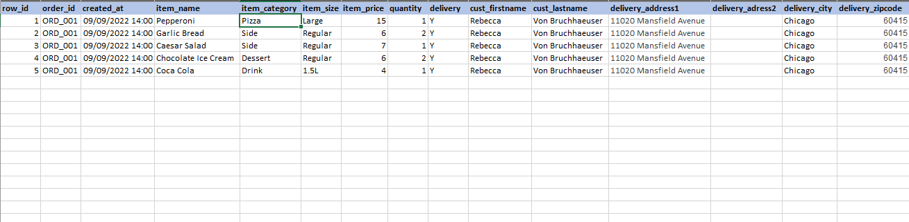
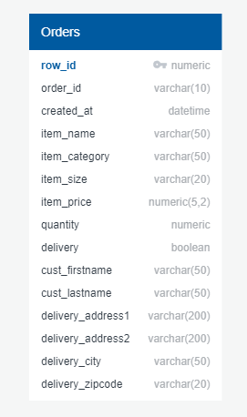
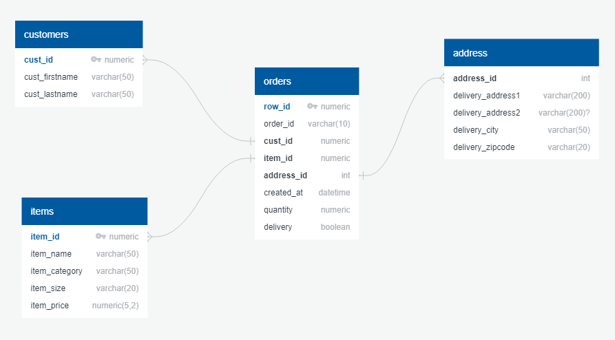
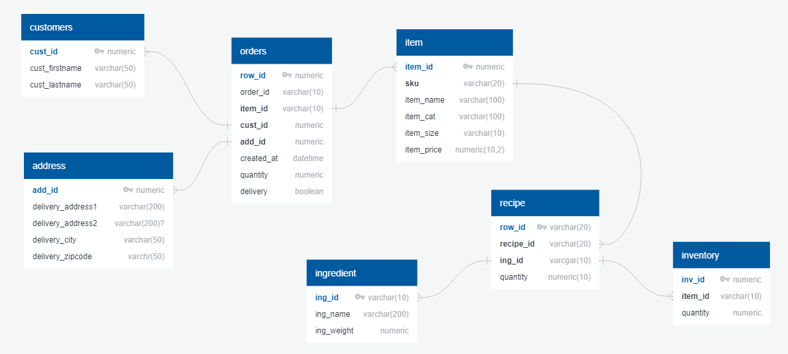
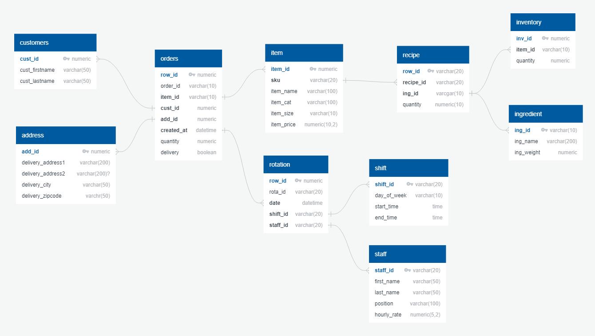
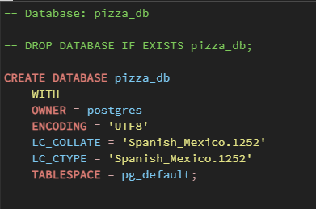
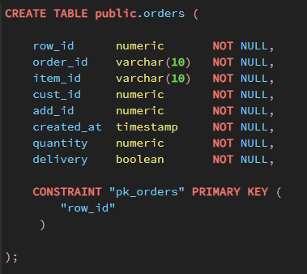
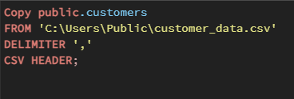
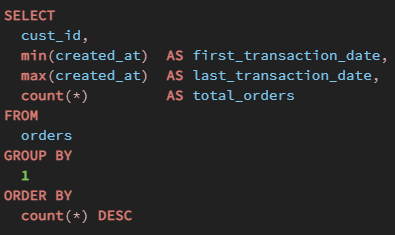

# Pizza_DB

Let's pretend we've been tasked with creating a relational database for a new take-out-and-delivery-only pizzeria, the end goal is to create a RDB suitable for later BI analytics. Our focus should be in the following areas:

* Orders
* Stock levels
* Staff

We'll start with an Orders table and grow the rest from there. A quick mock table in Excel should give us a good sense of what the field should be and how we should normalize the data later on. 

(**Note**: Since this is a made-up scenario all the data is made-up as well, for the image above it was easy enough to create it manually but for the actual tables the .csv files were created using https://www.mockaroo.com/ and so they're pretty much nonsense)

Now that have a nice grasp of what should be included in our table we can start sketching the schema:

Initial Table         |  Normalized
:-------------------------:|:-------------------------:
| 

With the foundations laid, let's now move to the remaining two areas.

Our stock tables should inform our client when it is time to refill. To that end we'll add three extra tables to our schema:

* Ingredients (for each pizza)
* Quantity (based on the size of the pizzas)
* Current stock levels

We'll also add a field to the items table called SKU (stock-keeping unit) to connect the new tables to the original ones:

Finally, the staff tables should let our client know which staff members are working when, and, based on their salaries, what the total cost (i.e ingredients + staff + delivery) of a pizza really is. For that another three tables are needed:

* Shifts
* Staff
* Rotations

We could complicate this a lot more but let's keep it simple and begin actually creating the database and tables with PostgreSQL:

Create Database        |  Create Tables                      |  Populate Tables
:-------------------------:|:-------------------------:|:-------------------------:
|  | 

With everything set-up we could, if we were working with real data, start queryng. We could wonder, to give a quick example, about the number of orders per client:

But since all we got is made-up junk data we'll stop here.

